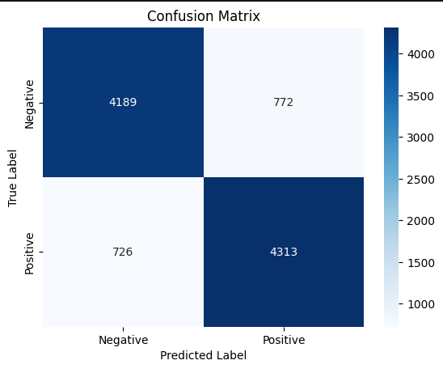

# NLP Sentiment Analysis

This is an **NLP project** for **sentiment analysis**, classifying movie reviews as **positive** or **negative** using Python and Machine Learning (TF-IDF + Naive Bayes).

---

## 🔹 Project Overview

This project demonstrates a complete NLP workflow:

1. Load and clean text data  
2. Convert text into numeric features (TF-IDF)  
3. Train a classifier (Multinomial Naive Bayes)  
4. Evaluate the model  
5. Save the trained model for later use

The goal is to create a simple **sentiment analysis model** for movie reviews.

---

## 🔹 Dataset

The dataset contains **movie reviews** with corresponding **sentiments** (positive/negative) from IMDB.  
You can download it here: [IMDB Dataset](https://media.geeksforgeeks.org/wp-content/uploads/20240514105101/IMDB-Dataset.csv)

- **Columns**:
  - `review` → Movie review text  
  - `sentiment` → Label (`positive` / `negative`)  

---

## 🔹 Result

Here are the **training results** (confusion matrix):

 